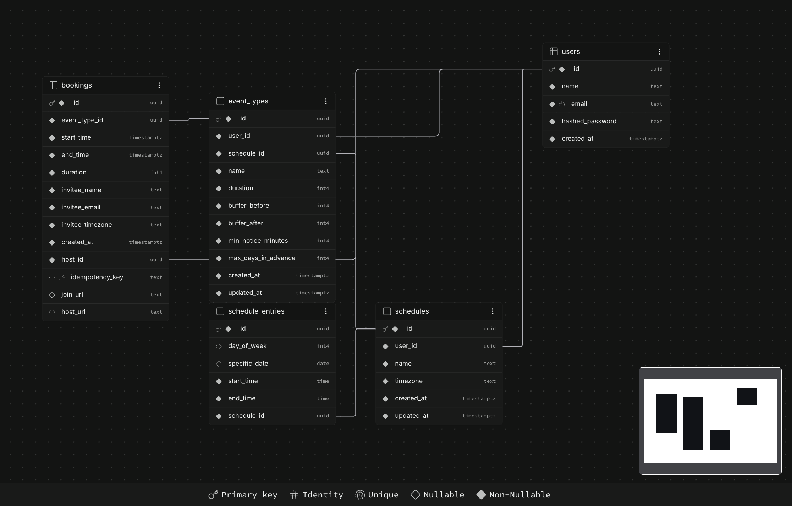

# Meeting Scheduler API (Java)

A Calendly-style scheduling backend. Organizers authenticate and define availability schedules and event types; anonymous invitees view dynamically computed open slots and book them — with correct timezone handling and guaranteed no double-booking, even under concurrent load.

**Stack:** Java 21 · Spring Boot 4 · Spring Data JPA (Hibernate) · PostgreSQL · Flyway · Spring Security (JWT) · Testcontainers · JUnit 5 + AssertJ · Docker

---

## The three things that make this more than CRUD

1. **Timezone correctness** — instants are stored in UTC (`timestamptz` → `java.time.Instant`); an organizer's zone is stored as an IANA name (e.g. `Asia/Kolkata`), never a fixed offset. Recurring "9:00–17:00" rules are resolved to real UTC instants against a specific date using `ZonedDateTime`, so DST is handled correctly (9 AM New York is `13:00 UTC` in summer, `14:00 UTC` in winter). Slots are returned in the invitee's own timezone.

2. **Dynamic availability engine** — free slots are computed on the fly, never pre-stored, by a **pure Java class with zero Spring or JPA imports**: expand the day's working windows → subtract existing bookings and buffers → enforce min-notice and max-days-in-advance → chunk into duration-sized slots. Being pure (no DB calls inside) makes it fully unit-testable in isolation — 24 JUnit tests, including exact-value assertions across a DST spring-forward gap and fall-back overlap.

3. **Concurrency / no double-booking** — the centerpiece. Two people hitting the same slot at the same millisecond resolve to **exactly one** booking, enforced at the database level. Retries are safe via idempotency keys. Details below.

---

## The double-booking problem (and how it's solved)

### The problem

Booking is a public endpoint: pick a slot, submit your details. To prevent double-booking, the naive approach is **check-then-insert** — first read the database to see if the slot is free (overlap check), and if it is, insert the booking.

That works for one request at a time. But it's **two separate operations**, and under concurrency they interleave. If two users request the same slot at the same instant:

```
User A: read  → slot is free ✓
User B: read  → slot is free ✓   (A hasn't written yet)
User A: write → booking created
User B: write → booking created   ← DOUBLE BOOKING
```

Both reads happen before either write commits, so both see an empty slot and both insert. The root cause: **check and write must be a single atomic operation**, but here they're two.

### Why you can't fix it in the app

- **In-memory locking?** You could lock the row/slot in application code (`synchronized`, a Java `Lock`) — but real deployments run **multiple server instances** behind a load balancer. A lock in instance A means nothing to instance B. There's one database but many app processes, so an app-level lock doesn't span them, and the race returns.
- **`SELECT ... FOR UPDATE`?** That locks *existing* rows — but the conflict is about a row that **doesn't exist yet** (you're inserting). There's nothing to lock.

The gap between "check" and "write" is fundamental to application-level logic. The only place it can be closed is where every request converges and can be **serialized**: the database.

### The fix — a Postgres exclusion constraint

The database enforces the invariant "no two overlapping bookings for the same host" atomically on every insert, using an `EXCLUDE` constraint (via the `btree_gist` extension), defined in the Flyway migration:

```sql
CONSTRAINT bookings_no_overlap EXCLUDE USING gist (
    host_id WITH =,
    tstzrange(start_time, end_time) WITH &&
)
```

It's a generalized `UNIQUE` constraint: instead of "no two rows are equal," it says "no two rows *overlap in time for the same host*." When two concurrent inserts race, Postgres serializes them — the first commits, the second is checked *against the first* and rejected with SQLSTATE `23P01`, which `BookingService` catches and maps to `409 Conflict`. Check and write are now one atomic, DB-enforced operation. No gap.

`BookingService` never issues a `SELECT` before its `INSERT` — the constraint is the single source of truth, not application logic.

### Proof

`BookingConcurrencyTest` fires 10 genuinely concurrent HTTP requests at the same slot — 10 real threads, a `CountDownLatch` starting-gun pattern, over 10 real HTTP connections into a Testcontainers-managed, disposable Postgres instance:

```
Tests run: 1, Failures: 0, Errors: 0

1 request  → 201 Created
9 requests → 409 Conflict, SQLState 23P01, all for the identical (host_id, time range),
             all logged within the same millisecond
bookingRepository.count() == 1
```

Run it yourself: `./mvnw test -Dtest=BookingConcurrencyTest` (requires Docker running).

### Retry safety — idempotency keys

The exclusion constraint stops *different* people from colliding. Idempotency solves a *different* failure: **the same person retrying.** If an invitee books a slot, the booking commits, but the response is lost to a network blip — their client retries. Without protection, the retry hits "slot already booked" (`409`) — confusing, because it was booked by *their own* first request.

With an idempotency key (a UUID the client sends in the `Idempotency-Key` header and reuses on retries), the server recognizes the repeat and **returns the original booking** instead of erroring or duplicating. A `UNIQUE` constraint on `bookings.idempotency_key` makes this safe even when the retry races the original — a post-failure recheck runs in a fresh transaction (`Propagation.REQUIRES_NEW`) to survive Postgres's "transaction is aborted" state after the failed insert. Result: **exactly-once** semantics.

---

## Architecture

Layered structure — `Controller → Service → Repository → Postgres`. Controllers are thin (HTTP binding + validation only), services hold all business logic, DTOs (Java records) keep entities from leaking across the API boundary. Requests are validated with Bean Validation at the boundary; a single `@RestControllerAdvice` handles errors centrally; JWT config is read from environment variables.

```
Controller → Service → Repository → Postgres
                │
                └──► Availability Engine (pure Java, no Spring/JPA imports)
```

The availability engine is deliberately isolated in its own package with a hard rule: no `org.springframework` or `jakarta` import, anywhere. The service layer is the only place that translates between JPA entities and the engine's plain `Interval`/`EventConfig` value types.

## Data model

`bookings` carries a denormalized `host_id` (so the exclusion constraint can enforce per-host overlap in a single table) and a unique `idempotency_key` for retry safety. `schedule_entries` store **local** clock times + an IANA zone (via the parent `schedules` row); bookings store **UTC** instants and snapshot their own duration so a later event-type edit never rewrites a past booking. Foreign keys are deliberately *not* cascading in most places (`event_types.schedule_id`, `bookings.host_id`, `bookings.event_type_id`) — deleting a schedule that still has event types attached fails with a `409`, rather than silently destroying data.



---

## API reference

| Method | Path | Auth | Description |
|---|---|---|---|
| `POST` | `/auth/signup` | public | Create an organizer account |
| `POST` | `/auth/login` | public | Log in, receive a JWT |
| `GET` | `/availability` | public | Compute open slots for an event type in a date range |
| `POST` | `/bookings` | public | Book a slot (double-booking-safe, idempotent) |
| `POST` `GET` `GET /{id}` `PUT /{id}` `DELETE /{id}` | `/schedules` | Bearer | Manage availability schedules (with entries) |
| `POST` `GET` `GET /{id}` `PATCH /{id}` `DELETE /{id}` | `/event-types` | Bearer | Manage bookable event types |
| `GET` | `/actuator/health` | public | Liveness + DB connectivity check |
| `GET` | `/swagger-ui/index.html` | public | Interactive API docs |

Protected routes require `Authorization: Bearer <token>` and are ownership-scoped (a user can only touch their own resources). Note: `/schedules/{id}` update is `PUT` (full replace, including all entries) while `/event-types/{id}` update is `PATCH` (genuine partial update) — a deliberate distinction based on what each resource's update actually does.

---

## Getting started

**Prerequisites:** JDK 21, Docker (for local Postgres and for Testcontainers-based tests).

```bash
git clone <this-repo>
cd meeting-scheduler-api-java
docker compose up -d
```

Create a `.env` file in the repo root:
```
JWT_SECRET=<output of: openssl rand -base64 32>
JWT_EXPIRATION_MS=86400000
```

Run the app:
```bash
./mvnw spring-boot:run
```

API docs: `http://localhost:8080/swagger-ui/index.html`

---

## Testing

**Unit tests** (the availability engine — pure functions, including DST edge cases):
```bash
./mvnw test -Dtest=AvailabilityEngineTest
```

**Concurrency proof** (Testcontainers — spins up a disposable real Postgres):
```bash
./mvnw test -Dtest=BookingConcurrencyTest
```

**Full suite:**
```bash
./mvnw test
```

**API collection** — a ready-to-run [Postman collection](./meetingSchedulerAPIJava.postman_collection.json) covers every endpoint above. Import it, run **Signup** then **Login** to auto-populate the auth token, then **createSchedule**/**createEventType** to auto-populate the IDs the rest of the collection depends on.
